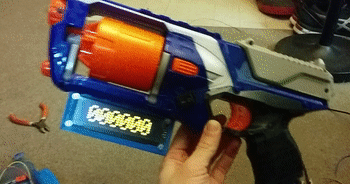
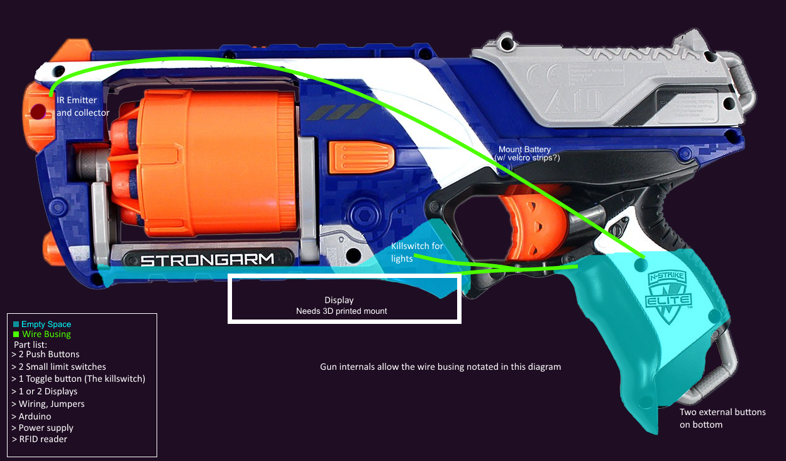

    
    

# Nerf Stat Tracker

An Arduino Nano based implementation of CSGO's StatTrak using as a Nerf gun mod. Includes:

* Custom bezel Blender model ([bezel/](bezel/))
* Driver for OLED display with dot font
* "USER UNKNWN" functionality using NFC reader in hilt
* Counter using IR sensor in gun barrel

Made for CE 420 - Microcomputers II

## Material

* [BuyDisplay ER-OLEDM032-1 - Yellow 3.2 inch OLED with header](https://www.buydisplay.com/yellow-3-2-inch-arduino-raspberry-pi-oled-display-module-256x64-spi).
 * I _highly_ suggest getting the one with headers, it made it so much easier and it was a couple dollars more
* [MFRC522 - NFC reader](https://www.newegg.com/p/0MJ-017Z-01258?item=9SIAJX6AS49556&source=region&nm_mc=knc-googlemkp-pc&cm_mmc=knc-googlemkp-pc-_-pla-superdigital-_-pos+-+rfid-_-9SIAJX6AS49556&gclid=CjwKCAiAnfjyBRBxEiwA-EECLPFsYTPPe9CsDgSRrsF1_PPAnVc6jwBIpjlEjvRNdanA01PrORO5LBoC2p4QAvD_BwE&gclsrc=aw.ds)
* Arduino Nano
* IR Emitter and IR Collector
* A few buttons for interacting with everything

## Build

* 3D print the [bezel](bezel/)
* Dremel bracket and gun to properly site under the barrel of the gun
* Switch the OLED display into SPI mode (you have to unsolder a jumper on the PCB, I believe the default was UART)
* Solder everything together (follow the description in the [stat_tracker.ino file](stat_tracker.ino))
* Put everything in the Nerf gun
* Aye, you did it! :D