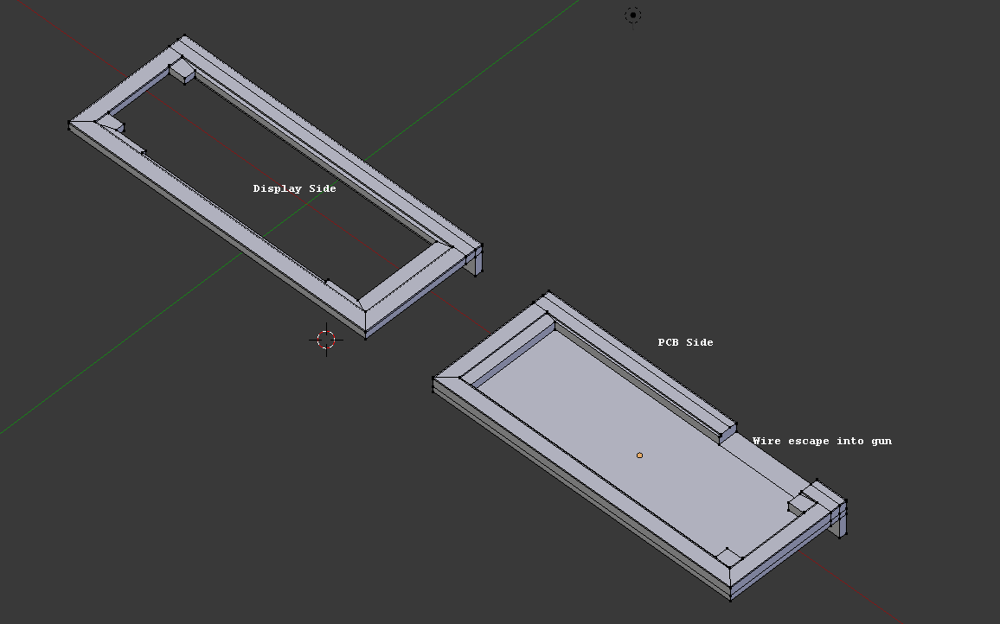

## Bezel

These are the STL and Blender files for the bezel. I don't recall which is the correct .blend file.

It was made to fit [BuyDisplay ER-OLEDM032-1 - Yellow 3.2 inch OLED with header](https://www.buydisplay.com/yellow-3-2-inch-arduino-raspberry-pi-oled-display-module-256x64-spi). It didn't take into account the insides of the Nerf gun and required a bit of dremelling.

See the main README for more information